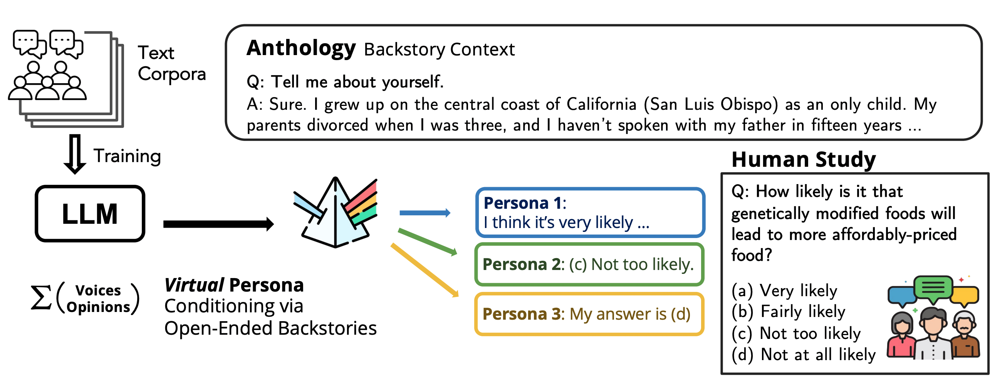

# Virtual Personas for Language Models via an Anthology of Backstories 
<!--- BADGES: START --->
[][#arxiv-paper-package]
[](https://opensource.org/licenses/BSD-3-Clause)


[#license-gh-package]: https://lbesson.mit-license.org/
[#arxiv-paper-package]: https://arxiv.org/abs/2407.06576
<!--- BADGES: END --->

<p align="center">
<a href="https://bair.berkeley.edu/blog/2024/11/12/virutal-persona-llm/">Read the blog post</a> |
<a href="https://arxiv.org/abs/2407.06576">Read the paper</a>
</p>




What does it mean for large language models (LLMs) to be trained on massive text corpora, collectively produced by millions and billions of distinctive human authors?
LLMs are capable of generating conditional text that represents the characteristics of an agent likely to have produced that context. 
This suggests that, with appropriate conditioning, LLMs could be guided to approximate the responses of a particular human voice, rather than the *mixture of voices* that otherwise emerges.

This raises an interesting question: __How can we condition the model to reflect a distinct, individual voice with precision, amidst the vast diversity of perspectives within the text corpora?__

To answer this question, we introduce ***Anthology***, a method for conditioning LLMs to representative, consistent, and diverse virtual personas by generating and utilizing naturalistic backstories with rich details of individual values and experience.
Additionally, we present methods for generating these backstories directly from LLMs, enabling efficient production of extensive sets that span a broad spectrum of human demographics. By grounding language models in detailed backstories, Anthology enhances their ability to simulate individual human profiles with greater accuracy, as measured by alignment with the distribution and consistency of authentic human responses.

## Installation
The configuration of all experiments is handled by [Hydra]("https://hydra.cc/). The configuration files can be found in the `configs` directory.

To install the required packages, you can use the following command:
```bash
git clone git@github.com:CannyLab/anthology.git
cd anthology
pip install -r requirements.txt
pip install -e .
```

## Generate Backstories
To generate backstories, you can use the following command:
```bash
python scripts/s0_self_generate_backstories.py num_backstories=1000 num_workers=10
```
The `num_backstories` parameter specifies the number of backstories to generate. The `num_workers` parameter specifies the number of workers to use for parallel processing. The default parameter config yaml file can be found in `configs/generate_backstory/config.yaml`. To change the parameters, you can refer to this link: [Generate Backstories Config](configs/generate_backstory/config.yaml)

## Load Backstories to Conduct Suvey
You might need to load the backstories to conduct downstream survey. For example, you might want to survey demographic information of the backstories. You can use the following command:
```bash
python scripts/s1_ask_demographics.py num_workers=10 backsotries.backstory_path="path_to_backstories"
```

The `backstories.backstory_path` parameter specifies the path to the backstories. The backstory path should be a directory containing the backstories.

## Define the new downstream task
To define the new task and its configuration, you have to make new configuration files in the `configs` directory. The configuration files should be named as `surveys/{task_name}_config.yaml`. The configuration files should contain the following parameters:
- `defaults`: The default parameters for the task
- `backstories`: The configuration for the backstories
- `llm_parameters`: The configuration for the language model to use

For example, if you want to define a new task called `survey_demographics`, you can create a new configuration file called `surveys/demo_config.yaml`. The configuration file should contain the following parameters:
```yaml
defaults:
  - backstories: self_generated
  - experiments/demographics:
    - age
    - education_level
    - gender
    - race
    - income_level
  - special_prompt: consistency_prompt
  - format/mcq_symbol: uppercase
  - format/choice_format: curved_bracket
  - format/surveyor_respondent: question_answer
  - llm_parameters: openai
  - _self_

# Set the output directory
hydra:
  run:
    dir: outputs/demo_survey/${now:%Y-%m-%d}/${now:%H-%M-%S}

run_dir: ${hydra:runtime.output_dir}

# output data name
output_data_name: ${now:%Y-%m-%d}_${now:%H-%M-%S}

# Debugging mode
debug: false

# Parallelization parameter
num_processes: 1

# The seed to use for the random number generator
seed: 42

# Frequency of saving the generated backstories
freq: 5
```

The parameters are explained as follows:
- `defaults`: The default parameters for the task
- `backstories`: The yaml configuration file of the backstories. [link](configs/surveys/backstories/self_generated.yaml) The configuration file should contain the following parameters:
  - `backstory_path`: The path to the backstories
  - `backstory_type`: The type of backstories. The type can be `self_generated` or `ANES` (American National Election Studies)
  - `num_backstories`: The number of backstories to use. If it is set to -1, all backstories will be used
  - `shuffle`: Whether to shuffle the backstories. If it is set to `true`, the backstories will be shuffled.
- `experiments/demographics`: The demographic information to survey. The demographic information can be `age`, `education_level`, `gender`, `race`, and `income_level`. The type of question (e.g., multiple choice, open-ended) can be specified in the configuration file. The exact wording and the available choices of each question are specifed in the configuration file.
  - `age`: The age of the respondent [link](configs/surveys/experiments/demographics/age.yaml)
  - `education_level`: The education level of the respondent [link](configs/surveys/experiments/demographics/education_level.yaml)
  - `gender`: The gender of the respondent [link](configs/surveys/experiments/demographics/gender.yaml)
  - `race`: The race of the respondent [link](configs/surveys/experiments/demographics/race.yaml)
  - `income_level`: The income level of the respondent [link](configs/surveys/experiments/demographics/income_level.yaml)
- `llm_parameters`: The yaml configuration file of the language model to use
- `special_prompt`: The special prompt to use for the task (e.g., consistency prompt) Possible values are [`consistency_prompt`](configs/surveys/special_prompt/consistency_prompt.yaml), [`cot_prompt`](configs/surveys/special_prompt/cot_prompt.yaml), [`no_prompt`](configs/surveys/special_prompt/no_prompt.yaml)
- `format/mcq_symbol`: The symbol to use for the multiple choice questions. Possible values are [`uppercase`](configs/surveys/format/mcq_symbol/uppercase.yaml), [`lowercase`](configs/surveys/format/mcq_symbol/lowercase.yaml), and [`number`](configs/surveys/format/mcq_symbol/number.yaml)
- `format/choice_format`: The format to use for the multiple choice questions. Possible values are [`curved_bracket`](configs/surveys/format/choice_format/curved_bracket.yaml), [`bracket`](configs/surveys/format/choice_format/bracket.yaml), [`dot`](configs/surveys/format/choice_format/dot.yaml), and [`space`](configs/surveys/format/choice_format/space.yaml)
- `format/surveyor_respondent`: The pharse to use for turn-taking between the surveyor and the respondent. Possible values are [`question_answer`](configs/surveys/format/surveyor_respondent/question_answer.yaml), [`surveyor_respondent`](configs/surveys/format/surveyor_respondent/surveyor_respondent.yaml), and [`interviewer_interviewee`](configs/surveys/format/surveyor_respondent/interviewer_interviewee.yaml)


## EXAMPLES OF SCRIPT RUN
Chat models for demographic survey
```bash
python scripts/run_demographic_survey_chat.py \
    backstories.backstory_path="path_to_backstories" \
    use_prefer_not_to_answer=False \
    format/surveyor_respondent=multiturn_chat \
    save_dir="path_to_saving_directory" \
    llm_parsing_parameters.top_logprobs=20 \
    llm_parsing_parameters.logprobs=True \
    num_processes=8
```
Generate backstory with demographic information
```bash
python scripts/run_backstory_gen_with_demographic_information.py \
    wave=111 \
    prompt_style=portray \
    llm_parameters=mixtral2_chat_together \
    save_dir="path_to_saving_directory" \
    num_processes=8
```
Demographic matching
```bash
python scripts/run_demographic_matching.py --demographic_survey_method chatmodel_multiturn --demographic_survey_file batch_1+2 --human_survey ATP_W34 --matching_method greedy
```
Run ATP survey
```bash
python scripts/run_atp_survey.py \
    wave=34 \
    questionnaire/ATP=ATP_W34_questions \
    backstories.backstory_path="path_to_backstories" \
    llm_parameters=mixtral2_together \
    num_processes=8 \
    save_dir="path_to_saving_directory"
```
Template of full survey run (2 basline methods, 3 demographics-conditioned backstoires, 3 demographic trait appended natural backstories with greedy matching, 3 demographic trait appended natural backstoires with maximum weight matching, total of 11 lines)
```bash
# baseline - QA
python scripts/run_atp_baseline_survey.py \
    wave=111 \
    questionnaire/ATP=ATP_W111_questions_second_new_set \
    prompt_style=qa \
    llm_parameters=llama3_70b_vllm \
    num_processes=128 \
    backstories.backstory_path="path_to_backstories" \
    save_dir="path_to_saving_directory"

# baseline - BIO
python scripts/run_atp_baseline_survey.py \
    wave=111 \
    questionnaire/ATP=ATP_W111_questions_second_new_set \
    prompt_style=bio \
    llm_parameters=llama3_70b_vllm \
    num_processes=128 \
    backstories.backstory_path="path_to_backstories" \
    save_dir="path_to_saving_directory"

# anthology - demographics-primed backstories generated by QA MCQ prompt
python scripts/run_atp_survey.py \
    wave=111 \
    questionnaire/ATP=ATP_W111_questions_second_new_set \
    llm_parameters=llama3_70b_vllm \
    num_processes=128 \
    output_data_name=DP_QA \
    backstories.backstory_path="path_to_backstories" \
    save_dir="path_to_saving_directory"

# anthology - demographics-primed backstories generated by PORTRAY prompt
python scripts/run_atp_survey.py \
    wave=111 \
    questionnaire/ATP=ATP_W111_questions_second_new_set \
    llm_parameters=llama3_70b_vllm \
    num_processes=128 \
    output_data_name=DP_PORTRAY \
    backstories.backstory_path="path_to_backstories" \
    save_dir="path_to_saving_directory"

# anthology - demographics-primed backstories generated by BIO prompt
python scripts/run_atp_survey.py \
    wave=111 \
    questionnaire/ATP=ATP_W111_questions_second_new_set \
    llm_parameters=llama3_70b_vllm num_processes=128 \
    output_data_name=DP_BIO \
    backstories.backstory_path="path_to_backstories" \
    save_dir="path_to_saving_directory"

# anthology - natural backstories with greedy matching, demographic traits appended with QA MCQ method
python scripts/run_atp_survey.py \
    wave=111 \
    questionnaire/ATP=ATP_W111_questions_second_new_set \
    llm_parameters=llama3_70b_vllm \
    num_processes=128 \
    output_data_name=NA_greedy_QA_MCQ \
    backstories.backstory_path="path_to_backstories" \
    save_dir="path_to_saving_directory"

# anthology - natural backstories with greedy matching, demographic traits appended with QA FREEFORM method
python scripts/run_atp_survey.py \
    wave=111 \
    questionnaire/ATP=ATP_W111_questions_second_new_set \
    llm_parameters=llama3_70b_vllm \
    num_processes=128 \
    output_data_name=NA_greedy_QA_FREEFORM \
    backstories.backstory_path="path_to_backstories" \
    save_dir="path_to_saving_directory"

# anthology - natural backstories with greedy matching, demographic traits appended with BIO method
python scripts/run_atp_survey.py \
    wave=111 \
    questionnaire/ATP=ATP_W111_questions_second_new_set \
    llm_parameters=llama3_70b_vllm num_processes=128 \
    output_data_name=NA_greedy_BIO \
    backstories.backstory_path="path_to_backstories" \
    save_dir="path_to_saving_directory"

# anthology - natural backstories with greedy matching, demographic traits appended with QA MCQ method
python scripts/run_atp_survey.py \
    wave=111 \
    questionnaire/ATP=ATP_W111_questions_second_new_set \
    llm_parameters=llama3_70b_vllm \
    num_processes=128 \
    output_data_name=NA_maximum_weight_QA_MCQ \
    backstories.backstory_path="path_to_backstories" \
    save_dir="path_to_saving_directory"

# anthology - natural backstories with greedy matching, demographic traits appended with QA FREEFORM method
python scripts/run_atp_survey.py \
    wave=111 \
    questionnaire/ATP=ATP_W111_questions_second_new_set \
    llm_parameters=llama3_70b_vllm num_processes=128 \
    output_data_name=NA_maximum_weight_QA_FREEFORM \
    backstories.backstory_path="path_to_backstories" \
    save_dir="path_to_saving_directory"

# anthology - natural backstories with greedy matching, demographic traits appended with BIO method
python scripts/run_atp_survey.py \
    wave=111 \
    questionnaire/ATP=ATP_W111_questions_second_new_set \
    llm_parameters=llama3_70b_vllm \
    num_processes=128 \
    output_data_name=NA_maximum_weight_BIO \
    backstories.backstory_path="path_to_backstories" \
    save_dir="path_to_saving_directory"
```
## Running Analysis Code
```bash
python scripts/run_atp_analysis.py \
    wave=111 \
    output_data_name="output_data_name" \
    experiment_repository="path_to_experiment_repository" \
    dist_type="EMD" # or "TV"
```

---
## Citation
```
@article{moon2024virtual,
  title={Virtual personas for language models via an anthology of backstories},
  author={Moon, Suhong and Abdulhai, Marwa and Kang, Minwoo and Suh, Joseph and Soedarmadji, Widyadewi and Behar, Eran Kohen and Chan, David M},
  journal={arXiv preprint arXiv:2407.06576},
  year={2024}
}
```
